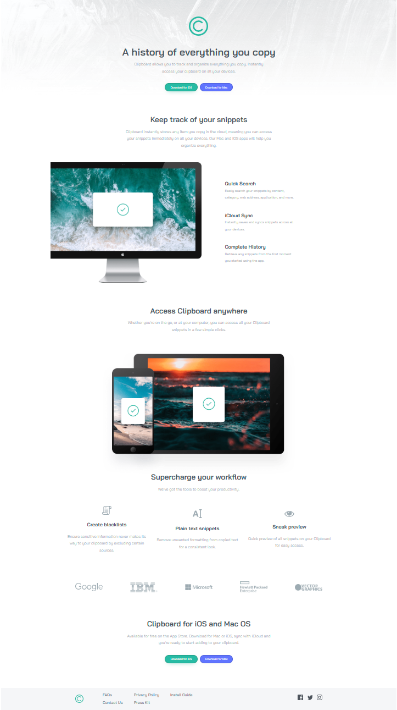
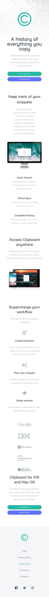

# 😶‍🌫️ Clipboard Landing Page - Page Solution

This is my first solution to the [Clipboard landing page challenge on Frontend Mentor](https://www.frontendmentor.io/challenges/clipboard-landing-page-5cc9bccd6c4c91111378ecb9/hub) and took me 12 hours to complete. Frontend Mentor challenges help you improve your coding skills by building realistic projects. If you are a beginner you really need to try this!

## 🪞 Screenshots

## 🎥 Live WebSite

- [Live site URL](https://alexandru-ghergu.github.io/clipboard-landing-page-master/)

## 🪄 Technologies

- `HTML5`
- `CSS`
- `Flexbox`

## 🎢 What I learned

- Still improving coding skills.
